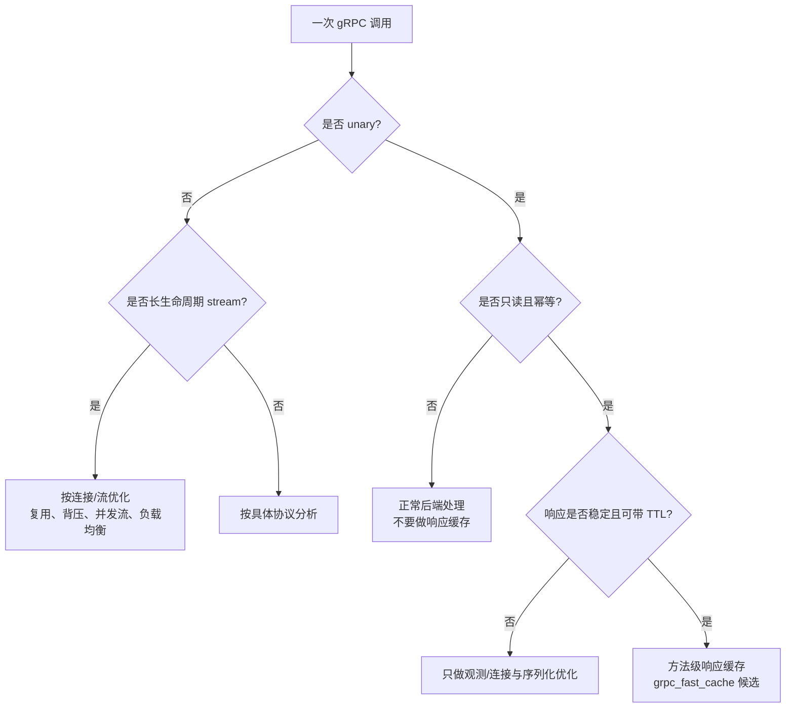
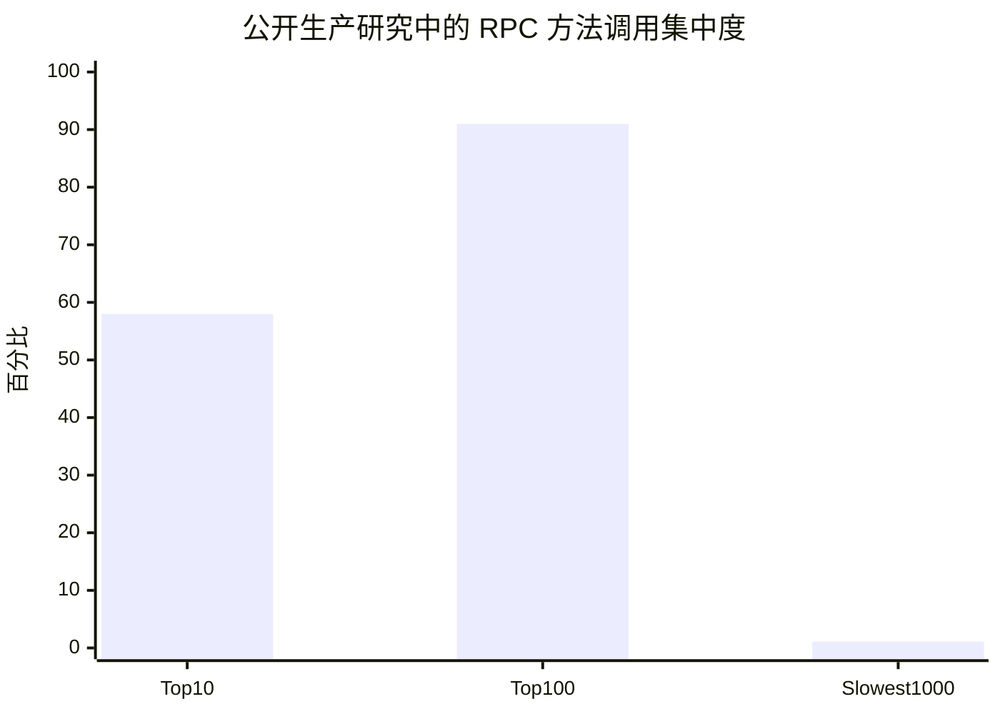

# gRPC 请求分布调研与 `grpc_fast_cache` 选型

日期：2026-08-10

## 先给结论

没有一个可以代表所有公司的“gRPC 请求类型百分比分布”。公开的一手资料更适合回答三个问题：

1. 哪些方法最值得优化？
2. 请求/响应大小和延迟是什么形状？
3. 哪些请求适合做 `grpc_fast_cache`？

对我们项目最重要的结论是：**gRPC 流量高度倾斜，应该针对少数高频、短消息、幂等读请求做方法级优化；不能把所有 gRPC 请求都当成可缓存流量。**

## 1. RPC 类型分布：先不要编造百分比

官方 gRPC 文档定义了四种方法类型：

| 类型 | 请求/响应形态 | 典型业务 | 对当前缓存的适配性 |
|---|---|---|---|
| Unary | 一个 request，对应一个 response | 健康检查、配置读取、特性开关、元数据查询 | 最适合 |
| Server streaming | 一个 request，服务端返回多个 message | 日志订阅、文件下载、事件列表 | 通常不适合固定响应缓存 |
| Client streaming | 客户端发送多个 message，服务端最后返回一个 response | 批量上传、批量聚合 | 不适合 |
| Bidirectional streaming | 双方持续读写 stream | 控制通道、实时推送、聊天、遥测 | 不适合固定响应缓存 |

gRPC 官方资料说明了这四种生命周期和消息方向，但没有声称某一种类型在整个行业占固定比例。因此本文不把“Unary 占 X%”当成事实。不同系统的分布会被业务形态决定：配置/控制面倾向 unary，实时数据面倾向 streaming。

来源：

- [gRPC Core concepts：四种 RPC 类型与生命周期](https://grpc.io/docs/what-is-grpc/core-concepts/)
- [gRPC Performance Best Practices：streaming 的适用场景与代价](https://grpc.io/docs/guides/performance/)

可以把类型分布画成下面这个“选型图”，而不是伪造一个通用饼图：



## 2. 公开生产研究：请求按方法高度倾斜

最接近“真实云上分布”的公开研究是 SOSP 2023 的 Google fleet RPC characterization。研究对象包含 Google Search、Gmail、Maps、YouTube 以及支撑这些业务的内部服务；研究分析了超过 10,000 个 RPC 方法、超过 10 亿条 trace，并使用接近两年的统计数据。研究同时覆盖 Stubby 和 gRPC，因此它不是只针对本仓库的 demo。

该研究报告的调用频率分布如下：

| 方法集合 | 占全部调用 | 说明 |
|---|---:|---|
| 最热门的 10 个方法 | 58% | 极少数方法承载了过半调用 |
| 最热门的 100 个方法 | 91% | 方法优化可以取得很高覆盖率 |
| 最慢的 1000 个方法 | 1.1% | 调用次数少，但占总 RPC 时间 89% |

这张图是根据论文报告的百分比重画的：



注意：最后一根柱子表示“最慢的 1000 个方法占全部调用 1.1%”，不是它们的时间占比；对应的总 RPC 时间占比是 89%。这说明“按 QPS 优化”和“按 CPU/延迟优化”应该是两套排序。

来源：[A Cloud-Scale Characterization of Remote Procedure Calls，SOSP 2023，论文原文](https://foci.uw.edu/papers/sosp23-rpc.pdf)，论文第 2.3 节和第 5.2 节。

## 3. 请求大小分布：小请求为主，但长尾很重

同一研究对 10,000 个 RPC 方法的请求/响应大小做了分布分析：

| 统计位置 | 请求大小 | 响应大小 |
|---|---:|---:|
| 最小 10% 方法的中位数上界 | 2030 B | 188 B |
| 50% 方法的中位数上界 | 1530 B | 315 B |
| P90 | 11.8 KB | 10 KB |
| P99 | 196 KB | 563 KB |

因此 gRPC 流量同时存在两类：

```text
大量小请求/小响应（mouse RPC）
        │
        └── 适合低延迟、方法级、短响应优化

少量大请求/大响应（elephant RPC）
        │
        └── 更应该关注流式传输、背压、分片、HOL blocking 和带宽
```

论文还指出，响应/请求大小比大于 1 的方法偏读型，小于 1 的方法偏写型；多数方法的中位比值小于 1，但大多数方法同时存在读主导和写主导的请求，不能仅凭方法名假定方向。这个结论对缓存很重要：**缓存候选应该看真实的请求语义和响应大小，而不是只看“这是一个 GET 风格的方法”。**

来源：[论文第 2.5 节：RPC Size Matters](https://foci.uw.edu/papers/sosp23-rpc.pdf)。

## 4. 延迟分布：平均值不是重点，尾延迟才是

公开研究观察到：

- 不同方法的完成时间从数百微秒到数秒，跨度很大；
- 90% 的服务中位延迟至少在 10.7 ms；
- 超过 99.5% 的方法，其 P99 延迟至少为 1 ms；
- 50% 的方法 P99 至少为 225 ms；
- RPC latency tax 平均只占 2%，但到 P90 可能升到 96%。

这说明 `grpc_fast_cache` 的收益不只来自少一次网络往返，还可能来自跳过：

```text
后端排队
→ gRPC handler 调度
→ Protobuf decode
→ 数据库/Redis/下游 RPC
→ Protobuf encode
→ HTTP/2 response
```

但它也说明一个边界：如果后端方法本身是 ML 推理、复杂聚合或大规模存储访问，简单返回一个静态 response 不能解决主要计算瓶颈；这类方法需要服务内部缓存、批处理、数据布局或专用加速。

来源：[论文第 2.3 节和第 5.2 节](https://foci.uw.edu/papers/sosp23-rpc.pdf)。

## 5. 映射到 `grpc_fast_cache`

### 5.1 当前项目实际测到的分布

当前仓库的 benchmark 不是生产流量分布，而是一个可复现的 h2c unary 对照实验。它使用：

- 一个 `HealthCheck` 方法；
- `SERVING`、`NOT_SERVING` 和未缓存 payload 三种响应情况；
- cache hit、response-cache miss、policy miss 和 direct backend 五条路径。

最近一次 node1 `netns + veth` 结果：

| 路径 | QPS | P99 |
|---|---:|---:|
| direct backend | 1541.50 | 830.41 us |
| cache hit SERVING | 20515.46 | 60.56 us |
| cache hit NOT_SERVING | 21618.34 | 69.14 us |
| response cache miss fallback | 1315.66 | 941.99 us |
| policy miss fallback | 1319.11 | 1050.47 us |

相对 direct backend，SERVING 命中路径约为：

- QPS `13.31x`；
- P99 延迟改善 `13.71x`。

这组结果说明的是“命中预构造响应、绕过后端”的收益，不是所有 gRPC 流量都能获得 13 倍加速。原始结果见 [`artifacts/grpc-fast-cache-bench/grpc-fast-cache-bench-20260804-160000/summary.md`](../artifacts/grpc-fast-cache-bench/grpc-fast-cache-bench-20260804-160000/summary.md)。

### 5.2 当前项目的真实分布观测能力

当前 `grpc_monitor` 可以在 tc ingress/egress 观察 IPv4/TCP/50051：

- 请求/响应包数；
- TCP payload 长度；
- 首个请求 payload 到首个响应 payload 的 transport RTT；
- h2 preface / HEADERS 的 best-effort 标记；
- ring buffer 丢事件数。

但它目前不是完整的 per-RPC 分析器：

- 事件里的 `payload_len` 是单个 TCP 包的 payload 长度，不是完整 gRPC message 大小；
- 没有解析完整 HTTP/2 stream 生命周期；
- 没有记录方法名、RPC 类型、完整 request/response byte 数；
- 多路复用连接、分片、streaming 会让“一个请求包对应一个 RPC”的假设失效。

因此现在还不能从 `grpc_monitor` 输出直接画出“Unary 占 70%、Streaming 占 30%”这类图。相关字段见 [`src/include/grpc_event.h`](../src/include/grpc_event.h) 和 [`bpf/grpc_monitor.c`](../bpf/grpc_monitor.c)。

## 6. 我们真正应该画的请求分布图

生产环境建议按下面五个维度采样，每个 RPC 方法形成一行：

```text
method
  ├── rpc_type: unary / server_stream / client_stream / bidi_stream
  ├── request_count、request_rate
  ├── request_bytes: p50 / p90 / p99
  ├── response_bytes: p50 / p90 / p99
  ├── latency: p50 / p95 / p99
  ├── status: OK / error / cancelled / deadline_exceeded
  ├── idempotent、auth_scope、tenant_scope
  └── cache_candidate: yes / no / unsafe / too_large / streaming
```

最终应该输出三张图，而不是一张饼图：

1. **方法集中度 CDF**：按调用次数排序，回答“优化前 10/100 个方法能覆盖多少请求”。
2. **请求/响应大小 CDF**：回答“多少请求适合短 response 快速返回，多少是 elephant RPC”。
3. **缓存候选矩阵**：横轴是命中率/重复度，纵轴是后端处理成本；右上角优先做缓存。

缓存候选矩阵可以这样理解：

```text
后端处理成本高
      ▲
      │       ★ FeatureFlag / Config / EndpointLookup
      │       ★ HealthCheck（短 TTL）
      │
      │  不稳定的用户画像       ML/大文件/stream
      │  或权限相关响应         不做固定响应缓存
      └──────────────────────────────► 请求重复度/命中率
```

这部分是基于公开分布和当前项目架构的工程推断，不是公开论文给出的统一比例。

## 7. 对当前项目的落地建议

### 第一阶段：补齐观测，不急着扩展缓存

建议把 `grpc_monitor` 的事件/用户态聚合扩展为：

```text
method_hash
stream_id
rpc_type
request_message_bytes
response_message_bytes
request_start_ns
response_end_ns
status_code
metadata_fingerprint
```

其中 method 名可以在用户态 h2c 解析器中提取；不要在 tc BPF 中做完整 HPACK/Protobuf 解析。生产环境如果启用 TLS，应该通过 gRPC interceptor 或 OpenTelemetry/应用侧 metrics 采集方法名和 RPC 类型，再与 tc 的 transport 指标关联。

### 第二阶段：优先做三类方法

1. `HealthCheck`：短 TTL，允许短暂陈旧；
2. `FeatureFlag/GetConfig`：请求 key 包含 tenant/service/flag，必须纳入身份边界；
3. `ServiceDiscovery/EndpointLookup`：版本或租约变化时主动失效。

### 第三阶段：把缓存从“固定健康响应”改成“完整 response bytes”

当前实现的响应缓存值主要是 `SERVING` / `NOT_SERVING`，响应由 [`src/grpc_fast_cache.cpp`](../src/grpc_fast_cache.cpp) 专门生成 HealthCheck protobuf。通用化时应缓存：

```text
method_hash
+ canonical_request_bytes_hash
+ auth/tenant scope
→ pre-serialized HTTP/2 + gRPC response bytes
```

同时补齐：

- 运行时 TTL 过期；
- 主动失效/版本号；
- single-flight，避免 miss 风暴；
- metadata/auth 参与 key；
- TLS 终止位置和缓存信任边界；
- streaming 明确旁路。

## 参考资料

- [gRPC Core concepts：四种 RPC 类型与生命周期](https://grpc.io/docs/what-is-grpc/core-concepts/)
- [gRPC Performance Best Practices](https://grpc.io/docs/guides/performance/)
- [gRPC-Go Benchmark：加权 payload size 分布的生成方式](https://chromium.googlesource.com/external/github.com/grpc/grpc-go/+/HEAD/Documentation/benchmark.md)
- [A Cloud-Scale Characterization of Remote Procedure Calls，SOSP 2023](https://foci.uw.edu/papers/sosp23-rpc.pdf)
